# Ansys Fluent 受力分析入门：从定义方向到可信的 Cd / Cl / Cm

> **适用版本**：本机可执行版本是 **Ansys Fluent 2022 R2（v222）**。2023 R1 及更新版本仍保留相同物理定义，但部分菜单位于 Ribbon、Results 或新的 Report Definitions 页面。本文会同时写出经典树状界面和新版界面的入口。
>
> **建议练习**：二维不可压圆柱绕流，`Re_D = 100`，稳态层流。先用这个算例学会阻力、受力面、参考值和力分解，再把同一套流程迁移到翼型、汽车或飞机。
>
> **公式显示**：Markdown 版公式使用 `text` 代码块和 Unicode 字符，不依赖 LaTeX 插件；[离线 HTML 版](ansys_force_analysis_guide.html) 则由本机 KaTeX 预渲染，并内嵌全部图片与公式。

---

## 1. 先确认：你要学的是哪一种“受力分析”？

Ansys 里的“受力分析”通常指下面两条不同路线：

| 路线 | Fluent 流体受力 | Mechanical 结构静力 |
|---|---|---|
| 输入是什么 | 流体运动、压力、黏性剪切 | 外载、约束、接触、材料 |
| Fluent 算什么 | 物体表面所受总力、力矩及系数 | 应力、应变、变形、反力 |
| 典型输出 | 阻力、升力、力矩、`Cd/Cl/Cm` | von Mises 应力、总变形、接触压力、反力 |
| 核心难点 | 参考面积/长度、方向、网格、收敛、力分解 | 约束刚度、接触、应力奇异、网格收敛 |

本文主体讲 **Fluent 流体受力**。如果你想学的是螺钉、支架、机匣或梁的强度校核，请看第 14 节的 Mechanical 快速路线。

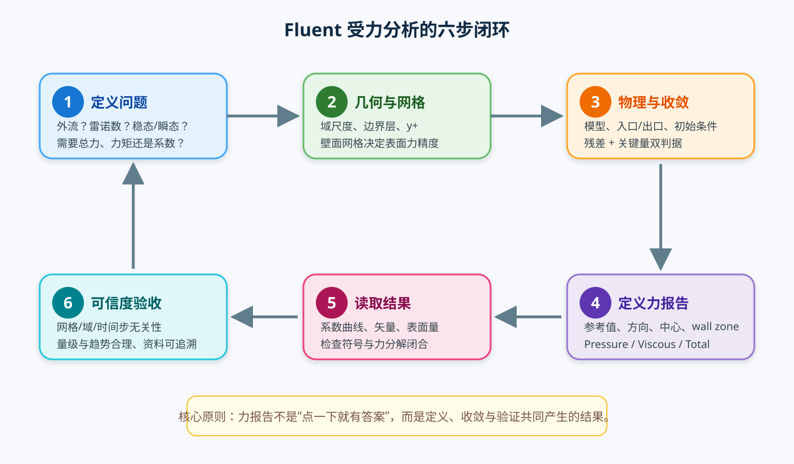

---

## 2. 学完后你应该能独立完成什么？

完成本文后，你应该能够：

- 在 Fluent 中定义 `Drag`、`Lift`、`Moment` 报告；
- 正确设置参考密度、速度、面积、长度和二维参考深度；
- 区分来流方向、阻力方向、升力方向与全局坐标轴；
- 读取压力力、壁面黏性力和总力，并验证三者关系；
- 解释为什么同一个模型换一个参考面积后 `Cd` 就会变化；
- 用残差和力系数历史**共同**判断稳态计算是否收敛；
- 做基本的网格、计算域和（瞬态问题中的）时间步无关性检查；
- 识别最常见的错误：受力面选漏、方向设反、参考面积错误、网格太粗、出口回流、只看残差。

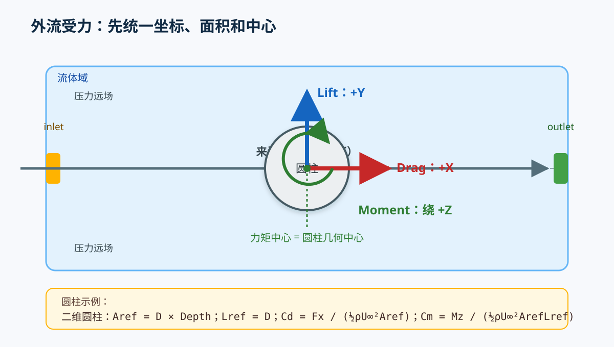

---

## 3. 先理解五个物理量

### 3.1 总力不是“凭空算出来”的

流体作用在物体壁面上的总力由两部分组成：

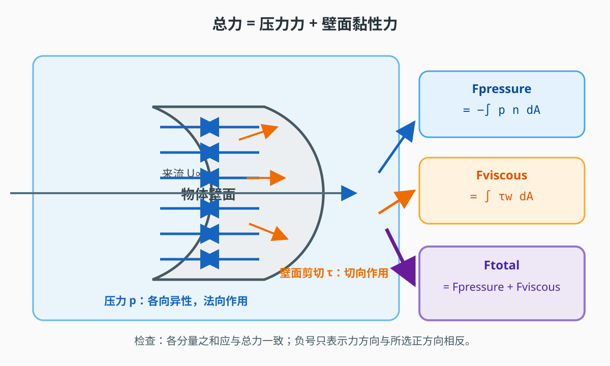

```text
F_total = F_pressure + F_viscous
```

- **压力力**：由当地静压力产生，沿壁面法向分布；
- **壁面黏性力**：由壁面剪切应力产生，沿壁面切向分布；
- Fluent 报告中的负号通常只表示方向与所选正方向相反，不代表计算错误。

### 3.2 阻力和升力是“投影”，不是 Fluent 自动猜出的物体类别

Fluent 先得到力矢量，再把它投影到你指定的力方向上：

- 来流沿 `+X` 时，阻力方向通常取 `(1, 0, 0)`；
- 二维 `XY` 平面内，升力方向通常取 `(0, 1, 0)`；
- 力矩轴通常取 `(0, 0, 1)`。

有攻角时不要直接默认“阻力永远等于 `Fx`、升力永远等于 `Fy`”。应先建立风轴方向：

```text
e_D = (cos α, sin α, 0)
```

```text
e_L = (-sin α, cos α, 0)
```

不同坐标约定可能使正负号相反，但方法不变：**沿阻力方向投影得到 `FD`，沿升力方向投影得到 `FL`**。

### 3.3 三个系数

令动压为：

```text
q∞ = (1/2) · ρ∞ · U∞²
```

则：

```text
C_D = F_D / (q∞ · A_ref)
```

```text
C_L = F_L / (q∞ · A_ref)
```

```text
C_M = M / (q∞ · A_ref · L_ref)
```

其中 `Aref` 和 `Lref` **没有脱离试验/报告约定的通用值**。报告别人的 `Cd` 前，先确认对方采用投影面积、湿面积、翼展面积还是机翼参考面积。

### 3.4 二维圆柱的单位和参考面积

二维 Fluent 给出的力通常是**单位展向深度的力**。若设置参考深度 `Depth = 1 m`：

```text
A_ref = D × Depth
```

不要把圆柱的湿面积 `πD × Depth` 误当成迎风投影面积。若只想比较无量纲 `Cd`，固定单位深度即可；需要物理总力时，再乘真实展长。

### 3.5 力矩必须同时给出中心和轴

二维绕 `Z` 轴的力矩：

```text
M_z = ∫_wall [(x - x_c)·dF_y - (y - y_c)·dF_x] dA
```

`Moment Center` 改变时力矩会改变。圆柱通常取圆心；飞机俯仰力矩常取重心、翼弦四分之一点或其他规定点，必须与目标数据一致。

---

## 4. 推荐练习：二维圆柱绕流

### 4.1 教学参数

| 项目 | 建议值 | 说明 |
|---|---:|---|
| 维度 | 2D planar，双精度 | 最适合先学后处理 |
| 圆柱直径 `D` | `1 m` | 任意长度尺度，不影响无量纲结果 |
| 来流速度 `U∞` | `1 m/s` | 沿 `+X` |
| 密度 `ρ` | `1 kg/m³` | 教学流体 |
| 动力黏度 `μ` | `0.01 Pa·s` | 使 `Re_D=100` |
| 雷诺数 | `ρUD/μ = 100` | 稳态层流圆柱的经典验证工况 |
| 参考面积 | `1 m²` | `D × 1 m` |
| 参考长度 | `1 m` | `D` |
| 参考深度 | `1 m` | 二维单位展深 |
| 网格 | 约 8–30 万单元 | 以能完成 3 档网格研究为准 |

这里使用“教学流体”是为了把注意力放在 Fluent 操作上，不代表真实空气参数。

### 4.2 计算域

建议二维平面尺寸：

- 圆柱中心在 `(0, 0)`；
- 左侧距离圆柱 `10D`；
- 右侧距离圆柱 `30D`；
- 上下各 `10D`；
- 圆柱为无滑移静止壁面。

圆柱算例的尾流很长，所以下游比上游更远。入门可先用上述尺寸；做域无关性时再把下游扩到 `40D`、侧边扩到 `15D`。

### 4.3 这个算例的合理预期

当网格、离散格式和定义一致时，`Re=100` 二维圆柱通常应得到：

- `Cl ≈ 0`：几何和来流上下对称；
- `Cm ≈ 0`：力矩中心取圆心；
- 稳态圆柱基准常用 `Cd≈3.2`（约 `3` 量级）做数量级检查。

上述基准仅指**二维、不可压、牛顿流体、均匀来流、no-slip 圆壁**，且参考面积按单位展长取 `A=D`。Dennis 与 Chang 的经典论文研究 `Re=5–100` 的二维稳态圆柱绕流并报告阻力系数；公开摘要没有给出 `3.2` 的数值表，所以不要把网页摘要当成完整数值表：  
<https://doi.org/10.1017/S0022112070001428>

此外，`Re≈100` 已接近圆柱绕流的非定常转捩区；如果尾流开始周期脱涡，稳态 `Cd≈3.2` 不能与瞬态或时间平均结果混用。出现非零 `Cl` 时，先查扰动、网格和收敛。这个范围只用于**发现数量级错误**，不能替代网格无关性和具体基准条件核对。

---

## 5. 详细 GUI 操作步骤

### 步骤 1：新建项目并确认版本

1. 打开 Workbench。
2. 左侧拖入 **Fluid Flow → Fluent**。
3. 双击 **Setup** 或在工程页面选择本机 Fluent 版本。
4. 本机实际版本是 **2022 R2**；文件夹名 `Ansys-2023R1` 不等于其中的程序版本。
5. 先保存工程到一个新目录，避免覆盖已有 `.cas/.dat`。

**完成标志**：Fluent Launcher 或 Fluent 窗口正常打开，控制台无许可错误。

### 步骤 2：建立二维几何

可在 SpaceClaim、Discovery、Fluent Meshing 或其他 CAD 软件中建立：

1. 新建一个 `XY` 草图平面。
2. 画一个直径 `1 m` 的圆，圆心放在 `(0, 0)`。
3. 画外包矩形：宽 `40 m`、高 `20 m`，并让圆柱大致位于上游 1/4 位置。
4. 用 **Combine/Subtract** 从流体域中扣除圆柱。
5. 保证所有边界已共享/ imprinted，避免重叠面。
6. 创建命名选择：
   - `fluid-domain`
   - `cylinder-wall`
   - `inlet`
   - `outlet`
   - `farfield-top-bottom`

**检查**：流体域中不应残留内部面；圆柱壁面应是独立、封闭的壁面区域。

### 步骤 3：设置网格

#### 3.1 基本尺寸

在 Meshing 中设置：

- 全局最大尺寸：约 `0.20D`；
- 圆柱表面尺寸：约 `0.02D`，保证圆周有约 150 个单元；
- 圆柱附近局部加密：半径约 `3D` 的 BOI；
- 圆柱径向至少约 70–100 层；
- 优先使用 O-grid 或质量较好的四边形网格；不方便时可用多边形/三角形，但不要在分离区过粗。

#### 3.2 边界层

- 层数：25–30；
- Growth Rate：约 `1.15`；
- 首层高度：可从 `1e-3D` 起步；
- Re=100 层流入门时 `y+` 不是唯一判据，但高雷诺数外流必须重新按所选壁面模型检查 `y+`。

#### 3.3 质量门槛

- Maximum Skewness：建议 `< 0.85`，至少不要接近 `0.95`；
- Minimum Orthogonal Quality：建议 `> 0.15`；
- 圆柱与网格之间不应有突然断层；
- 尾流方向至少加密到圆柱下游约 `5–10D`。

**完成标志**：能清楚看到圆柱表面、附着区和尾流区都有足够单元。

### 步骤 4：设置 General

进入 **Setup → General**：

| 选项 | 建议值 |
|---|---|
| Solver | Pressure-Based |
| Time | Steady |
| Velocity Formulation | Conservative（若版本提供） |
| 2D Space | Planar |
| Gravity | Off |

初学阶段不要同时打开 Energy、组分、燃烧、多相、辐射和真实气体等无关模型。

### 步骤 5：设置模型和材料

1. **Setup → Models → Viscous**：
   - 选择 **Laminar**。
2. **Setup → Materials → Fluid**：
   - `Density = 1 kg/m³`；
   - `Viscosity = 0.01 Pa·s`。
3. **Setup → Operating Conditions**：
   - 保持 `Operating Pressure = 0 Pa`，所有压力按表压解释；
   - 重力关闭。

完成后再次手算：

```text
Re_D = (1 × 1 × 1) / 0.01 = 100
```

### 步骤 6：设置边界条件

#### 6.1 入口 `inlet`

设为 **Velocity Inlet**：

- Velocity Magnitude：`1 m/s`；
- Direction：`X = 1, Y = 0, Z = 0`；
- 层流模型下无需填写湍流强度和黏性比。

#### 6.2 出口 `outlet`

设为 **Pressure Outlet**：

- Gauge Pressure：`0 Pa`；
- Backflow Total Pressure：一般保持 `0 Pa`；
- 若设置过出口回流，优先改用压力远场或把出口向下游移动，而不是继续迭代硬收敛。

#### 6.3 上下远场

可设为 **Pressure Far Field**：

- Gauge Pressure：`0 Pa`；
- Flow Direction：`X = 1, Y = 0, Z = 0`。

#### 6.4 圆柱壁面

保持 **Wall**：

- Thermal：不要无关设置；
- Motion：Stationary Wall；
- 不设滑移，否则黏性力和绕流形态都会改变。

**完成标志**：`Console` 中没有“未定义边界”“负面积”或区域名缺失提示。

下面的官网图展示如何找到边界任务页和 Wall 设置。图片来自 Fluent 2026 R1；本机 2022 R2 的字段相同，但标签位置可能略有差别。完整页面 URL 和图片原始 URL 见 [官方配图来源清单](figures/official/README_zh.md)。

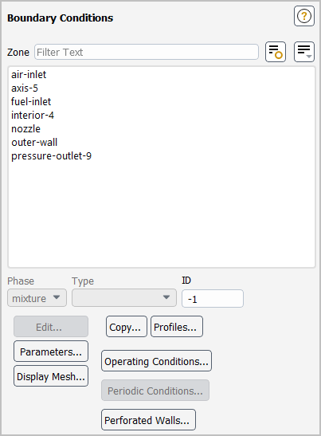

*Ansys Fluent User’s Guide 2026 R1，Boundary Conditions Task Page。Screenshot courtesy of Ansys, Inc.*

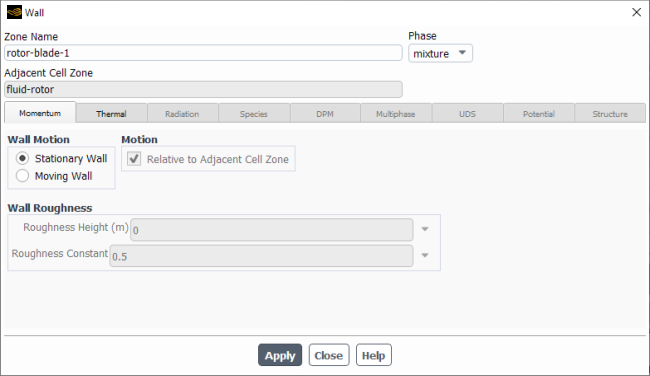

*Ansys Fluent User’s Guide 2026 R1，Wall Dialog。Screenshot courtesy of Ansys, Inc.*

### 步骤 7：设置 Reference Values

进入 **Setup → Reference Values**。经典树通常显示为 `Setup → Reference Values`；新版可能位于 Setup 页面或结果报告设置中。

手动填写：

| 字段 | 值 |
|---|---:|
| Reference Density | `1 kg/m³` |
| Reference Velocity | `1 m/s` |
| Reference Viscosity | `0.01 kg/(m·s)` |
| Reference Pressure | `0 Pa` |
| Reference Temperature | `300 K`（本例未用能量，仅作元数据） |
| Reference Area | `1 m²` |
| Reference Length | `1 m` |
| Reference Depth | `1 m` |

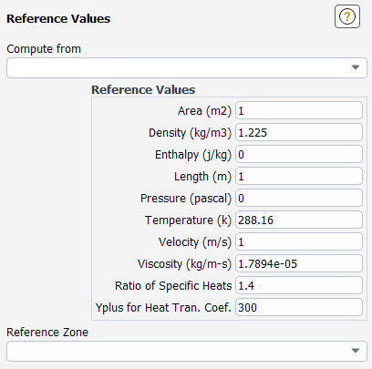

*Ansys Fluent User’s Guide 2026 R1，Reference Values Task Page。Screenshot courtesy of Ansys, Inc.；本机 2022 R2 的字段名称相同，布局可能不同。*

方向：

- Drag：`(1, 0, 0)`；
- Lift：`(0, 1, 0)`；
- Moment Axis：`(0, 0, 1)`。

**关键提醒**：

- 不要让 Fluent 从圆柱湿壁面自动得到面积后，就把它当作迎风投影面积；
- 圆柱面积应按你的定义手动输入 `D × Depth`；
- 修改参考值后，系数报告需要重新计算。

### 步骤 8：先一阶稳定，再切二阶

1. **Solution → Methods**：
   - Pressure：先 First Order Upwind；
   - Momentum：先 First Order Upwind。
2. **Solution → Initialization**：
   - 选择 Hybrid Initialization；
   - Compute。
3. 初始化。
4. 先迭代 200–300 次，观察是否稳定、有无回流。
5. 若稳定，把 Pressure 和 Momentum 改为 **Second Order Upwind**。
6. 创建 `Cd/Cl/Cm` 报告后，再迭代 500–1500 次。

不要一开始就二阶上满：初学者很难区分“数值发散”和“物理模型不合适”。

### 步骤 9：创建三个收敛报告

经典入口：

- **Solution → Report Definitions → New**
- 或右键 **Report Definitions → New**

新版入口通常为：

- **Results → Reports → Definitions → New**

依次创建：

#### A. 阻力报告

- Name：`drag_total`
- Type：Force
- Boundaries/Zones：只选 `cylinder-wall`
- Force Vector：`(1, 0, 0)`
- Scale：`1`
- Coefficient：启用
- Print / Plot / Write：按需启用
- Report Frequency：可设 5 或 10

#### B. 升力报告

- Name：`lift_total`
- Type：Force
- Boundaries/Zones：`cylinder-wall`
- Force Vector：`(0, 1, 0)`
- Coefficient：启用
- Print / Plot / Write：启用

#### C. 力矩报告

- Name：`moment_total`
- Type：Moment
- Boundaries/Zones：`cylinder-wall`
- Moment Center：`(0, 0, 0)`
- Moment Axis：`(0, 0, 1)`
- Coefficient：启用
- Print / Plot / Write：启用

然后在 **Solution → Report Files/Report Plots** 中加入这些报告。

#### 官网 GUI 对照：报告定义与输出

以下均为 Ansys Fluent User’s Guide 2026 R1 官方截图。它们比本机 2022 R2 新，字段定义相同，但 Ribbon 布局可能不同。

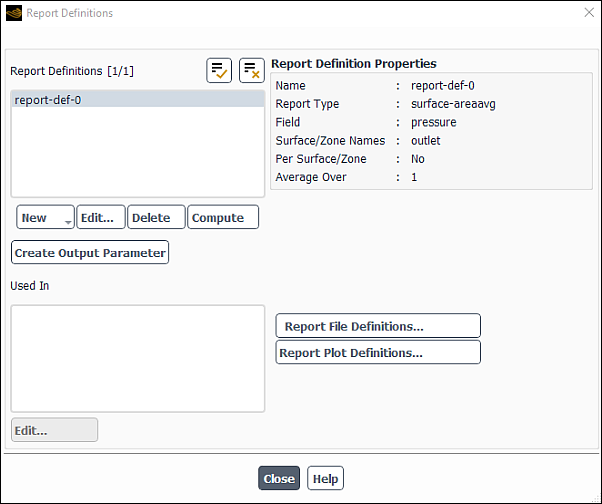

*Report Definitions：浏览、创建和修改报告。Screenshot courtesy of Ansys, Inc.*

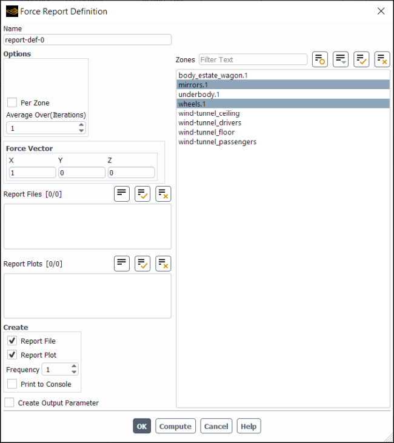

*选择 Wall Zones、填写 Force Vector，并创建 Report File/Plot。Screenshot courtesy of Ansys, Inc.*

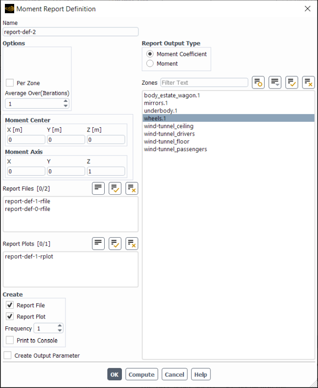

*Moment 输出可选择原始 Moment 或 Moment Coefficient，并设置 Center 与 Axis。Screenshot courtesy of Ansys, Inc.*

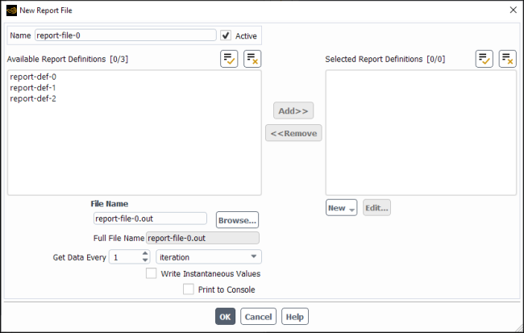

*报告文件用于保存每个迭代/时间步的监控量。Screenshot courtesy of Ansys, Inc.*

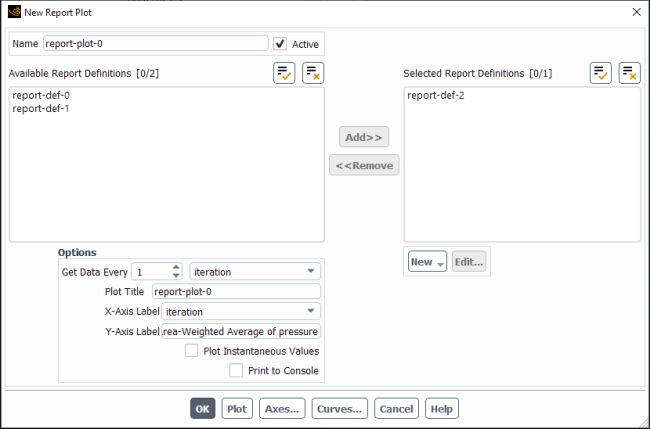

*报告曲线可同时显示 Cd、Cl、Cm；频率不要大到淹没迭代过程。Screenshot courtesy of Ansys, Inc.*

### 步骤 10：运行并判断“力是否收敛”

不要只盯残差。至少同时看：

1. 连续性、动量残差是否持续下降或稳定在足够低的水平；
2. `Cd`、`Cl`、`Cm` 后 200–500 次迭代的变化是否很小；
3. 出口是否出现 backflow/reversed flow；
4. 质量流量是否基本守恒；
5. 压力场和尾流是否还在缓慢变化。

教学算例可先采用：

- 残差目标约 `1e-5`；
- `Cd` 最近 200 次迭代变化小于约 `0.1%–0.5%`；
- `Cl`、`Cm` 接近 0 且稳定。

如果残差下降但 `Cd` 持续漂移，流场对研究量仍未收敛；如果 `Cd` 很平但质量严重不守恒，也不能直接验收。

### 步骤 11：用一次性 Force/Moment 报告检查分解

不同版本入口可能是：

- **Results → Reports → Definitions → Force**；
- **Report → Forces...**；
- 或在 Console/TUI 中使用 `report forces`。

操作：

1. Boundaries：只选 `cylinder-wall`；
2. Force Vector：`(1, 0, 0)`；
3. Compute；
4. 查看输出表中的 `Pressure`、`Viscous`、`Total` 三组矢量；
5. 逐分量验证：

```text
F_x,pressure + F_x,viscous = F_x,total
```

```text
F_y,pressure + F_y,viscous = F_y,total
```

6. 再计算一次 Moment Report，中心 `(0,0,0)`、轴 `(0,0,1)`。

报告中常见的 `Net` 表示选中的壁面合力。若想核对所选壁面的中心压力位置，官方本机帮助还提供 **`report/forces/pressure-center`**。如果误选了入口、出口、外壁或多余壁面，这个 `Net` 会失去物理意义。

### 步骤 12：后处理不只看一个系数

建议依次查看：

#### A. 壁面静压力

- **Results → Graphics → Contours**
- Surfaces：`cylinder-wall`
- Variable：Static Pressure 或 Pressure Coefficient

检查高压是否位于迎风驻点附近，低压尾迹区是否合理。

#### B. 壁面剪切

- Variable：Wall Shear 或 Skin Friction Coefficient。

Re=100 圆柱的总阻力预计以压力力为主；如果黏性力异常大，优先检查壁面网格、速度尺度和黏度。

#### C. 流线/路径线

- 显示速度矢量或流线；
- 检查圆柱前后是否出现不合理的回流、回旋或出口堵塞。

#### D. 壁面力矢量

若版本提供 **Surface/Force Vectors**，分别显示压力力、黏性力和总力。不同版本中该入口可能位于 **Results → Graphics → Vectors** 或自定义场变量中。若没有该专用入口，至少用静压力、壁面剪切和 Force Report 的定量分解来判断。

#### E. 表面曲线

- **Results → Plots → XY Plot**
- Surface：`cylinder-wall`
- 可画 `Cp` 或 `Cf` 随圆周角位置的变化。

这比只看一张彩色云图更容易发现符号、参考面积或区域选择错误。

#### F. 报告曲线

- 横轴：Iteration 或 Flow Time；
- 纵轴：`Cd_total`、`Cl_total`、`Cm_total`；
- 另外把压力/黏性/总力分解放到同一图上，检查分量之和。

#### 官网 GUI 对照：后处理

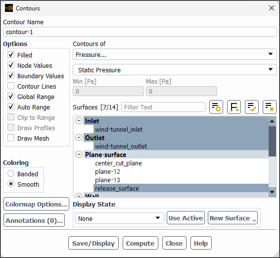

*选择变量和 Surfaces 后生成压力、壁面剪切等云图。Screenshot courtesy of Ansys, Inc.*

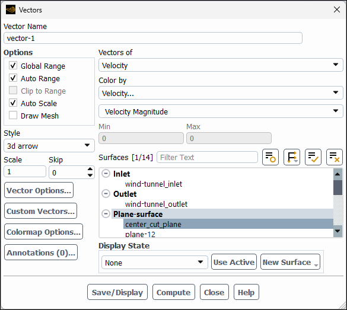

*Vectors 用于速度方向和流场结构检查；受力大小仍以 Force Report 为准。Screenshot courtesy of Ansys, Inc.*

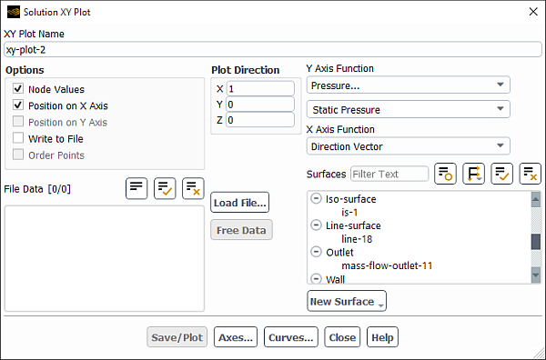

*XY Plot 适合画壁面 Cp/Cf 随圆周位置的变化。Screenshot courtesy of Ansys, Inc.*

### 步骤 13：建立最小验证矩阵

不要只跑一个网格就宣布完成。至少做三档网格：

| 网格 | 圆柱周向单元 | 径向单元 | 边界层 |
|---|---:|---:|---|
| 粗 | 约 100 | 约 50 | 20–25 层 |
| 中 | 约 160 | 约 80 | 25–30 层 |
| 细 | 约 240 | 约 120 | 30–35 层 |

记录：

- 单元数；
- 最小正交质量、最大偏斜；
- `Cd`、`Cl`、`Cm`；
- 压力力/黏性力占比；
- 收敛迭代数。

经验验收：相邻两档网格的 `Cd` 变化小于约 `1%–2%`，且变化方向稳定。还应做一次域尺寸检查：把下游扩到 `40D`、侧边扩到 `15D`，若 `Cd` 变化小于约 `0.5%–1%`，说明边界位置影响已较小。

> 这些是工程起步阈值，不是所有工况的法定标准。试验误差、转捩、模型形式和后处理积分方法都可能需要更严格阈值。

### 步骤 14：做质量守恒检查

1. 创建 **Flux Report / Mass Flow Rate**。
2. 分别计算入口和出口质量流量。
3. 归一化不平衡：

```text
mass_imbalance = abs(m_dot_in - m_dot_out)
                / max(abs(m_dot_in), abs(m_dot_out))
```

入门可把 `<0.1%` 当作较好目标；本项目现有基线使用更宽松的 `0.5%` 作为通道算例闸门。若明显超限，检查边界类型、未收敛、压力出口回流、网格质量和模型设置。

---

## 6. 三套菜单位置怎么对应？

| 功能 | 2022 R2 经典树 | 2023 R1 / 新版常见入口 |
|---|---|---|
| 参考值 | `Setup → Reference Values` | Setup 页面的 `Reference Values` |
| 迭代中创建报告 | `Solution → Report Definitions → New` | `Results → Reports → Definitions → New` |
| 一次性力报告 | `Report → Forces...` | `Results → Reports → Definitions → Force` |
| 一次性力矩报告 | `Report → Moments...` | `Results → Reports → Definitions → Moment` |
| 云图 | `Results → Graphics → Contours` | `Results → Contours` |
| 矢量 | `Results → Graphics → Vectors` | `Results → Vectors` |
| 表面曲线 | `Results → Plots → XY Plot` | `Results → Plots → XY Plot` |
| 报告曲线 | `Solution → Report Plots` | `Results → Reports → Plots` |

如果找不到某个菜单，不要连续猜入口：先在 Fluent 中打开 **Help → Search**，搜索 `force report definition`、`moment report definition` 或 `reference values`。也可使用 Ribbon 右上角的命令搜索框。

---

## 7. 怎样从圆柱迁移到翼型或汽车？

### 7.1 翼型/机翼

1. 将 `cylinder-wall` 换成完整翼型/机翼壁面。
2. 建立风轴 Drag/Lift 方向；有攻角时不要固定用全局 X/Y。
3. `Aref` 和 `Lref` 必须来自目标试验/文献定义：
   - 二维翼型常用弦长与单位展深；
   - 三维机翼常用计划面积与平均气动弦等约定。
4. 力矩中心常取四分之一弦长，但必须核对目标报告。
5. 高雷诺数下检查网格、湍流模型、转捩和尾迹平均方式。
6. 非定常工况不要报告某一个瞬时 `Cd`；应在多个脱落周期后做时间平均，并同时给出 RMS/波动范围。

### 7.2 汽车/Ahmed body

1. 参考面积通常按目标试验的迎风投影面积定义；
2. 重点加密前缘、A 柱、侧窗、后视镜和尾流；
3. 监控前/后轮升力、侧倾力矩和总阻力；
4. 出口必须离汽车足够远，并检查 backflow；
5. 同时看总力与分区域力，防止漏选车身壁面。

### 7.3 管流/通道

管流中“阻力”往往不是外流阻力，而是压降、摩阻和局部损失。应优先使用：

- 入口/出口质量流量；
- 面积加权静压；
- 壁面剪切积分；
- 压降与解析解/试验的对比。

---

## 8. 最常见的错误与排错

| 现象 | 最可能原因 | 怎么修 |
|---|---|---|
| `Cd` 几乎为零 | 来流与阻力方向垂直、方向向量写错、受力壁面漏选 | 先看原始力矢量，再改方向；检查所有物体壁面 |
| `Cd` 为负 | 来流实际沿 `-X`，但报告方向取 `+X` | 统一坐标与来流方向；不要直接取绝对值掩盖错误 |
| `Cd` 改变 10 倍 | `Aref`、速度、密度或深度不一致 | 手工复核 `qA` 和二维展深 |
| `Cl/Cm` 不为零且很大 | 本应对称的几何/网格不对称 | 查几何、网格、求解容差和报告中心 |
| Fluent 提示 zone not found | 壁面区域名与报告不同 | 在 `Setup → Boundary Conditions` 或网格树核对真实名称 |
| 残差很低但 `Cd` 漂移 | 关键研究量未收敛、出口回流、湍流非定常 | 看报告曲线，延长迭代或改用瞬态统计 |
| `Cd` 随网格显著增大 | 压力梯度/分离区过粗 | 加密圆柱表面、BOI 和尾流；不要只加全域网格 |
| 压力力异常小 | 参考压力错误、受力面不完整或法向/符号理解错误 | 检查 gauge pressure、完整壁面和原始力表 |
| 黏性力异常大 | 壁面分辨率差、黏度单位错、无滑移设置错 | 查材料、边界层、y+ 和壁面网格 |
| 出口总出现回流 | 出口太近、面积不足、背压/堵塞设置不合理 | 延长下游、增加出口面积或改压力远场 |
| 瞬态均值每个周期不同 | 统计时间不足、初始场落水尚未消失 | 先丢掉过渡段，再统计至少若干脱落周期 |
| 某处应力/力出现尖峰 | 尖角、网格跳变、接触或奇异定义 | 局部看网格与法向；不要只看单点最大值 |

---

## 9. 一次合格的报告应该记录什么？

建议建立一个固定表格，每行对应一次算例：

| 字段 | 示例 |
|---|---|
| Case / Mesh | `cylinder_D1_Re100_medium` |
| Fluent version | `2022 R2 / v222` |
| Cells | 实际单元数 |
| Max skewness / Min orthogonal | 实际值 |
| `Re_D` | `100` |
| `Aref / Lref / Depth` | `1 m² / 1 m / 1 m` |
| Drag/Lift/Moment directions | `(1,0,0)/(0,1,0)/(0,0,1)` |
| Moment center | `(0,0,0)` |
| `Cd / Cl / Cm` | 收敛窗口内的统计值 |
| Pressure/Viscous/Total | 三个原始力分量 |
| Residual state | 最终残差 |
| Mass imbalance | 归一化质量不平衡 |
| Iterations / physical time | 稳态迭代数或瞬态统计时间 |
| Domain size | `40D × 20D` 等 |
| Notes | 模型、异常和图片路径 |

一个系数若没有参考面积、方向、版本、网格和收敛信息，几乎没有复用价值。

---

## 10. 如何利用当前仓库自动化？

本仓库的 Fluent 自动化已经能输出：

- `Fx/Fy/Fz`；
- `Cd/Cl`；
- Pressure / Viscous / Total 力分解；
- 残差历史、出口回流告警和调参建议。

相关入口：

- [README 的真实 Fluent 运行说明](../README.md#真实-fluent-运行已验证)
- [飞机外流配置](../configs/case_airplane.json)
- [受力报告 journal 生成逻辑](../aeroharness/journal_gen.py)
- [系数换算与收敛判据](../aeroharness/post.py)
- [外流域和网格建议](external_flow_domain_and_mesh.md)

但当前实现有两个必须知道的边界：

1. 当前只自动计算 `Cd=Fx/(qA)`、`Cl=Fy/(qA)`，**尚未实现 Moment、Moment Center 和 `Cm`**；
2. `case_airplane.json` 中 `area=1.0` 是占位值，必须按试验/文献改成正确的 `Aref`；`length=1.0` 也没有被当前后处理用于 `Cm`。

自动化时只修改 `configs/*.json` 参数，不要手写或修改 journal 语法；真实批量计算前先跑单次并检查方向、区域、网格和收敛。

---

## 11. 建议的三阶段学习路线

### 阶段 A：先做对（二维圆柱，约半天）

目标：

- `Cl≈0`、`Cm≈0`；
- `Cd` 回到约 `3` 的量级；
- 压力力 + 黏性力 = 总力；
- 粗/中/细网格的 `Cd` 变化可解释。

### 阶段 B：理解定义（NACA 翼型，约 1 天）

目标：

- 自己设置风轴 Drag/Lift 方向；
- 用弦长、二维深度计算 `Aref`；
- 理解攻角符号；
- 比较 `Cp` 曲线而不是只看云图。

### 阶段 C：进入真实工程（汽车/飞机，约 1 周以上）

目标：

- 定义与试验一致的 `Aref/Lref/Moment Center`；
- 做网格、域、统计时间无关性；
- 处理非定常脱落和湍流模型敏感性；
- 将手动验证过的定义迁移到本仓库 JSON 配置。

---

## 12. 官方与第三方资料

> 资料按“先查官方定义 → 再做官方教程 → 最后用第三方经验排查”的顺序使用。下面只列应实际打开核验的链接；若官方页面要求登录，标题和目录仍可用于站内搜索。

### 12.1 官方文档

1. **Ansys Help — Fluent Documentation**  
   用于查当前版本的用户指南、Theory、教程和菜单定义。  
   <https://ansyshelp.ansys.com/>

2. **Ansys Help — Fluent 2023 R1**  
   从官方 Help 首页选择 **Fluent 2023 R1 → Ansys Fluent User's Guide**。重点站内检索：`force report definition`、`moment report definition`、`reference values`、`surface reports`、`vector graphics`。Ansys 当前在线帮助正文通常要求登录；若你本机有许可，可在 Fluent 内按 `F1` 搜索同一术语。  
   <https://ansyshelp.ansys.com/>

3. **Ansys Help — Ansys Fluent Tutorial Guide 2023 R1**  
   从同一官方入口选择 **Fluent 2023 R1 → Ansys Fluent Tutorial Guide**，再按 `external flow`、`airfoil`、`automotive` 或 `cylinder` 检索。不要只照抄网格，要记录版本、参考面积和统计方式。  
   <https://ansyshelp.ansys.com/>

4. **本机 Fluent 2022 R2 离线 GUI Help（字段级核验）**  
   本机可用 `F1` 或安装目录中的 `commonfiles/help/en-us/fluent_gui_help/fluent_gui_help.xml` 查 `Force Vector`、`Boundaries`、`Coefficient`、`Moment Center`、`Moment Axis`、`Compute Forces/Compute Moments`。

5. **Ansys Innovation Space — 公开学习入口**  
   官方录播课程与学习路径的旧站已迁移到 <https://innovation.ansys.com/public>；直接访问可能遇到 Cloudflare 或登录要求。进入后搜索 `Fluent Fundamentals`、`Introduction to Fluent`、`External Aerodynamics`、`CFD Post Processing`。已单独核验的旧站课程标签页为 **Estimation of Lift Force Recommended**，但它是课程分类入口，不是完整外流算例：  
   <https://innovationspace.ansys.com/courses/course-tag/estimation-of-lift-force-recommended/>

6. **Ansys Student**  
   官方学生产品与学习资源入口：<https://ansys.synopsys.com/academic/students/ansys-student>。旧址的 `/ansys-cfd-tutorials` 路径目前返回 404，不应再作为可用教程链接；登录/下载入口中搜索 `CFD tutorials`、`Fluent` 和 `external flow`。

### 12.2 Cornell SimCafe：最值得跟做的公开教程

Cornell University 的 Simulation Café / SimCafe 教程很适合补足“力报告不只是按钮”的问题。页面正文通过公开 Confluence API 实际读取并核验；网页 UI 在自动化环境中可能返回空响应，但这些 URL 本身可访问。

1. **Airfoil – Physics Setup**  
   用 `Compute From` 设置参考值，并检查自动生成值是否符合边界条件。  
   <https://confluence.cornell.edu/spaces/SIMULATION/pages/144976447/Flow+over+an+Airfoil+-+Physics+Setup>

2. **Airfoil – Step 5：Force Monitor 与 Reference Values**  
   展示翼型壁面选择、非零迎角的 Drag/Lift 方向、Print/Plot 和残差判据。  
   <https://confluence.cornell.edu/spaces/SIMULATION/pages/90744036/FLUENT+-+Flow+over+an+Airfoil-+Step+5>

3. **Airfoil – Numerical Results**  
   演示 `Results → Reports → Forces` 中设置 6° 攻角方向并输出 `Cd/Cl`。  
   <https://confluence.cornell.edu/spaces/SIMULATION/pages/144976456/Flow+over+an+Airfoil+-+Numerical+Results>

4. **Airfoil – Step 7：压力/表面摩擦分解与网格验证**  
   最重要的验证页：说明 `Cd = Cd_pressure + Cd_skin_friction`；其案例中 `Cl` 加密只变约 0.3%，`Cd` 却变约 45%，因此不能因升力已收敛就宣布整套结果可信。  
   <https://confluence.cornell.edu/spaces/SIMULATION/pages/90744042/FLUENT+-+Flow+over+an+Airfoil-+Step+7>

5. **Airfoil – Verification & Validation**  
   区分网格验证与实验验证，并说明无黏模型为何不能直接验证真实黏性阻力。  
   <https://confluence.cornell.edu/spaces/SIMULATION/pages/144976461/Flow+over+an+Airfoil+-+Verification+Validation>

6. **VAWT – Moment Center 示例**  
   演示不同叶片使用不同 `Moment Center`，并联力矩曲线、质量守恒与网格加密。  
   <https://confluence.cornell.edu/spaces/SIMULATION/pages/333371307/Vertical+Axis+Wind+Turbine+Part+1+-+Numerical+Solution>  
   <https://confluence.cornell.edu/spaces/SIMULATION/pages/333371309/Vertical+Axis+Wind+Turbine+Part+1+-+Verification+Validation>

> 这些页面创建于 2008–2016 年，部分仍显示旧版 Fluent 菜单。**照着字段语义和物理逻辑学，不要机械照抄菜单路径、迭代次数或具体系数。**

### 12.3 推荐学习顺序

1. 先完成本文 `Re=100` 圆柱，确认 `Cl/Cm≈0`、力的分解闭合；
2. 做 Cornell Airfoil Physics Setup 与 Step 5，练习非零攻角方向；
3. 做 Step 7，重点理解“每个研究量都要单独做网格检查”；
4. 做 VAWT Moment 页面，理解力矩中心；
5. 再迁移到自己的翼型、汽车或飞机。

### 12.4 第三方资料的使用原则

- 优先大学 CAE 课程和能展示完整算例的页面；
- 查看发布日期和适用版本；
- 若文章只说“阻力 = X”，却没写参考面积、方向、受力面和网格，不足以作为可靠教程；
- 不同文章的正负号可能相反，冲突时以你自己的坐标定义和原始力矢量为准。

---

## 13. 一页式操作清单

### 计算前

- [ ] 明确要 `Force`、`Moment` 还是系数；
- [ ] 明确来流方向；
- [ ] 明确 Drag/Lift 方向；
- [ ] 明确力矩中心和轴；
- [ ] 明确 `Aref/Lref/Depth`；
- [ ] 明确参考密度和速度；
- [ ] 确认 Re、稳态/瞬态、湍流模型；
- [ ] 确认所有物体壁面名称。

### 网格与边界

- [ ] 上游、侧边、下游尺寸足够；
- [ ] 壁面、尾流和压力梯度区已加密；
- [ ] 网格质量合格；
- [ ] 出口无明显回流；
- [ ] 参考压力和材料单位一致。

### 求解

- [ ] 先稳定、后二阶；
- [ ] 残差、力系数、质量守恒同时检查；
- [ ] 报告频率足以看到收敛；
- [ ] 未把低残差等同于研究量收敛。

### 后处理与验收

- [ ] 压力力 + 黏性力 = 总力；
- [ ] `Cl/Cm` 的零值符合对称性；
- [ ] `Cd` 量级合理；
- [ ] 已检查压力和壁面剪切分布；
- [ ] 已做至少三档网格；
- [ ] 已做域尺寸检查；
- [ ] 瞬态问题已做时间步和统计区间检查；
- [ ] 报告记录版本、参数、收敛和文件路径。

---

## 14. 如果你实际想学 Mechanical 结构静力与吊塔分析

已另写一份完整图文教程，覆盖通用静力、工程力学手算，以及塔式起重机吊塔的整体梁—格构杆件—节点/基础分级建模：

- [Ansys Mechanical 静力分析并应用到塔式起重机吊塔](ansys_mechanical_static_tower_analysis_tutorial_zh.md)

最短学习路线是：先做整体梁模型并与 `ΣF=0、ΣM=0` 手算对拍，再升级为格构式梁杆模型，最后对关键节点、锚栓、基础以及大位移、稳定、动力和疲劳做专项分析。线性静力中的最大应力不能单独证明吊塔安全。

---

## 15. 最后记住这五句话

1. **先统一坐标，再谈阻力和升力。**
2. **先确认参考面积和受力壁面，再相信系数。**
3. **总力必须等于压力力加壁面黏性力。**
4. **残差下降不等于力已经收敛。**
5. **没有网格、域、统计时间和来源记录的结果，不算可复现结果。**
