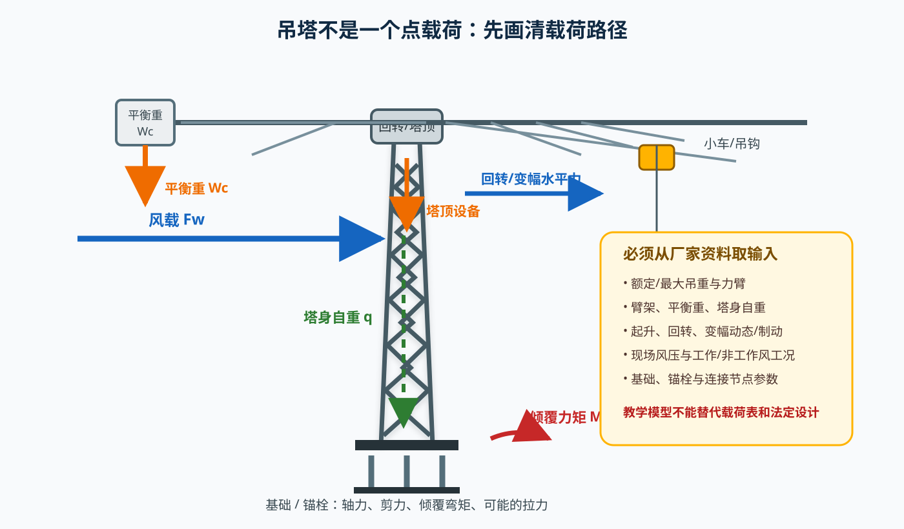
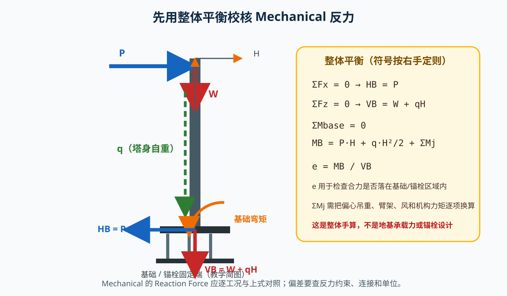
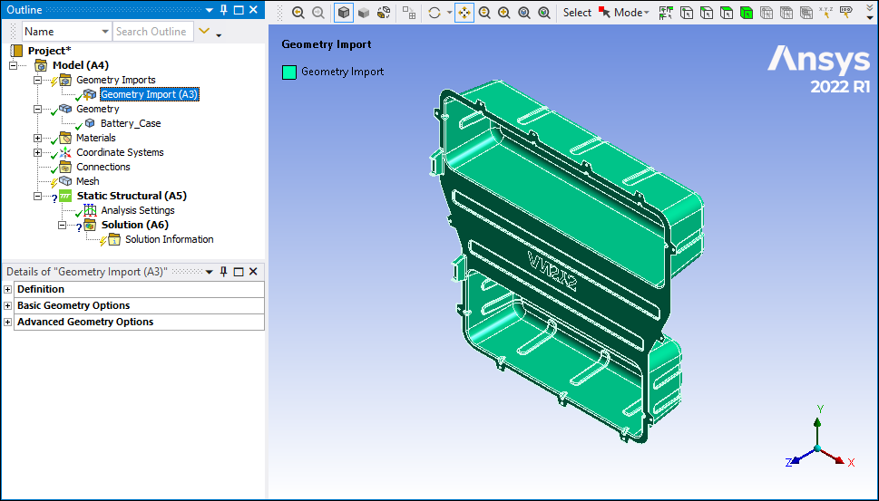
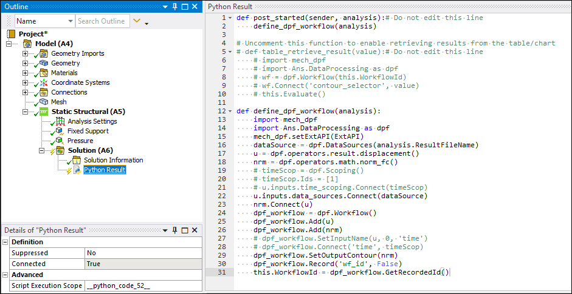
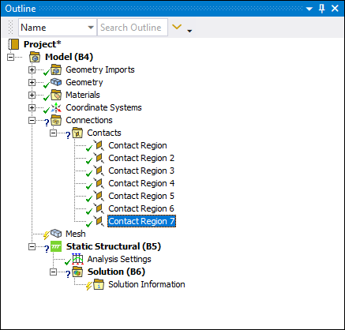
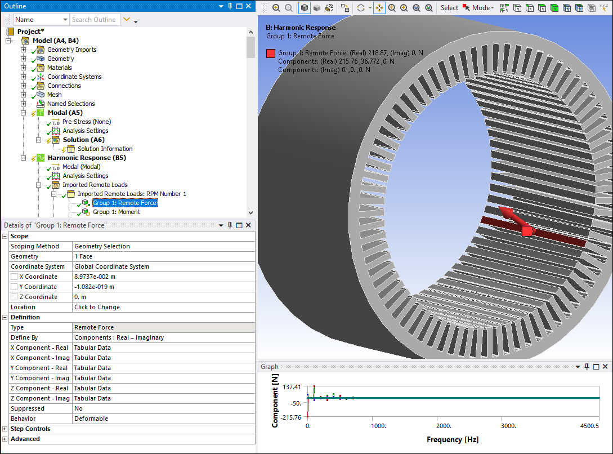
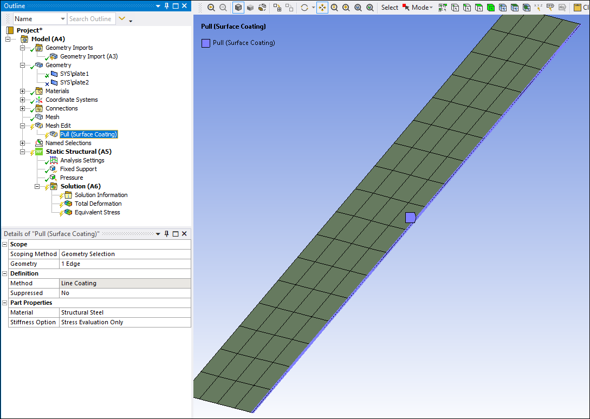
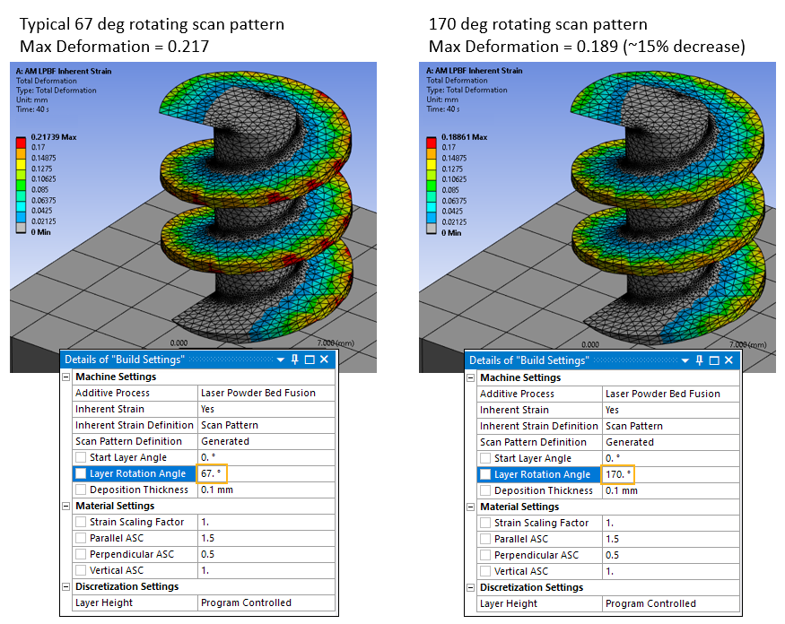
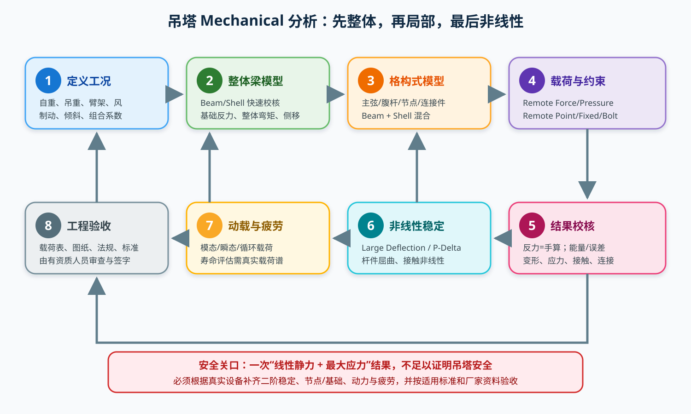

# Ansys Mechanical 静力分析入门，并应用到塔式起重机吊塔

> **教学定位**：本文用于学习 Mechanical 的结构受力分析，并把方法迁移到塔式起重机塔身/吊塔。文中数值只用于演示“手算—仿真对拍”，**不是某一台起重机的设计计算书，也不能替代厂家载荷表、适用标准、基础资料或法定审查**。
>
> **适用版本**：本机可执行文件是 **Ansys 2022 R2（v222）**，虽然安装目录名包含 `2023R1`；真正的 2023 R1 内部版本号是 `v231`。本文菜单以本机 2022 R2 为基准，并兼顾 2023 R1/更新版本；Ribbon、树节点和求解设置名称可能略有变化，但物理模型、连接、边界、反力校核和网格收敛原则不变。
>
> **配套阅读**：[Fluent 流体受力分析教程](ansys_fluent_force_analysis_tutorial_zh.md)。吊塔风压若由 CFD 得到，可在本教程的载荷定义处单向传入 Mechanical。
>
> **公式显示**：Markdown 版公式使用 `text` 代码块和 Unicode 字符，不依赖 LaTeX 插件；[离线 HTML 版](ansys_force_analysis_guide.html) 则由本机 KaTeX 预渲染，并内嵌全部图片与公式。

---

## 1. 先明确：Mechanical 静力和 Fluent 流体受力不是一回事

| 对比 | Mechanical 结构静力 | Fluent 流体受力 |
|---|---|---|
| 分析对象 | 固体杆件、板、连接件和基础 | 流体压力、剪切和流场 |
| 主要输入 | 材料、几何、载荷、约束、接触 | 几何、网格、边界条件、湍流模型 |
| 典型方程 | 固体平衡 + 材料本构 | Navier–Stokes + 湍流/多相模型 |
| 典型结果 | 应力、应变、位移、反力、屈曲、疲劳 | 压差力、黏性力、阻力、升力、力矩 |
| 主要校核 | 整体力/力矩平衡、变形、应力、网格、连接 | 残差 + 目标力、网格、域、守恒 |
| 吊塔中的角色 | 塔身、臂架、平衡重、回转平台、节点、锚栓、基础 | 风压或机构载荷的来源；也可与结构做单向耦合 |

本文先讲通用结构静力，再用“塔式起重机吊塔”贯穿。

---

## 2. 静力分析到底在解什么？

### 2.1 最基本的目标方程

结构静力分析寻找满足整体平衡和材料本构关系的位移场：

```text
K(u) · u = f
```

在**线性、小位移、小应变**条件下：

```text
σ = C : ε
```

并满足：

```text
∇ · σ + b = 0
```

初学阶段应把结果理解为：

- 外载和约束如何进入结构；
- 哪些杆件受拉、受压、弯曲或剪切；
- 基础需要提供多大的反力；
- 结构会变形多少；
- 哪个位置可能先达到强度、刚度或稳定极限。

### 2.2 三种常用理想化

| 理想化 | 适合做什么 | 优点 | 主要风险 |
|---|---|---|---|
| Beam（梁/线单元） | 塔身整体、格构式主弦和腹杆内力 | 快、便于看轴力/剪力/弯矩 | 看不到节点局部应力、截面翘曲和板件局部屈曲 |
| Shell（壳单元） | 箱型塔节、节点板、臂架箱梁、局部板件 | 兼顾膜应力和弯曲，能看局部板变形 | 薄板厚度方向划分、焊缝和接触仍需处理 |
| Solid（实体单元） | 节点板、耳板、焊缝、锚栓孔、基础局部 | 可看真实三维应力与接触 | 全塔用实体极其昂贵，且网格/接触会让问题复杂化 |

正确策略通常是**整体用梁、局部用壳/实体**，而不是全部都用实体。

---

## 3. 吊塔先画载荷路径，不要先点软件



对塔式起重机，至少要区分以下载荷来源：

1. **塔身、臂架、拉杆、平衡重、回转平台和机构自重**；
2. **吊重经钢丝绳、吊具和小车传下来的竖向载荷**；
3. **吊重重心偏离塔轴线产生的倾覆力矩**；
4. **臂架、平衡重、塔顶设备和拉杆的偏心重力矩**；
5. **起升、回转、变幅、制动或突然停车产生的水平和竖向动态作用**；
6. **工作状态和非工作状态风载**；
7. **安装、拆卸、检修、顶升和特殊工况**，但只在设备资料或适用工况要求时分析；
8. **基础、地脚螺栓和连接节点的约束反力**。

这些值必须来自该设备的图纸、厂家载荷表、计算书和适用标准。**不能把“吊重×力臂”之外的动态放大系数和风系数随便拍一个数。**

### 3.1 风荷载怎样进入 Mechanical？

若厂家/规范直接给出面压或节点风载，按定义施加。若从风压场换算为结构面力，可写成：

```text
p_i = q(z_i) · Cp_i
```

```text
F_i = ∫_Ai [(-p_i) · n_i] dA
```

其中 `q(z)` 是随高度变化的基本风压或动压，`Cp,i` 是体型/方向/构件系数，法向 `n` 的符号要与 Mechanical 面法向约定一致。

格构式塔筒需要额外核对：

- 迎风/背风构件的投影面积；
- 构件实度比和孔隙率；
- 前后构件屏蔽；
- 斜杆与横杆的方向系数；
- 脉动风、阵风和共振；
- 回转/非回转方向差别。

若由 Fluent 得到了塔身表面压力，可将压力场通过 System Coupling 或单向下游映射传入 Mechanical；但网格映射、截断面积和单位必须核验。Fluent 的压力场不能替代厂家/规范风工况。

### 3.2 工况表先建结构，再填数字

| 工况代号 | 教学含义 | 典型输入 | 数值来源 |
|---|---|---|---|
| `SW` | 自重/空载 | 塔身、臂架、平衡重、机构自重 | 设备图纸/厂家计算书 |
| `G-L` | 吊载工况 | 规定吊重、力臂、吊具和位置 | 载荷表/厂家工况 |
| `W-op` | 工作风 | 吊载或空载 + 工作风 | 适用标准和厂家规定 |
| `D-dyn` | 机构动作 | 起升/回转/变幅/制动作用 | 厂家动力学资料 |
| `W-nonop` | 非工作风 | 特定姿态下的最大风 | 标准和厂家规定 |
| `ERECT` | 安装/拆卸/顶升 | 允许姿态、部分构件、临时荷载 | 安装手册/专项方案 |
| `FAULT` | 故障/紧急状态 | 制动、失效或偏载等 | 仅在设备资料明确要求时 |

每个工况还要记录载荷方向、作用点、符号、组合系数和是否允许同时出现。**没有厂家/标准依据时，不要自行创造 `D-dyn`、`FAULT` 或荷载放大系数。**

---

## 4. 工程力学手算：先做整体平衡对拍



### 4.1 一般形式

把某一吊塔系统作为整体隔离体。以基础中心或控制点为参考，对任一工况求：

```text
ΣF_x = 0,   ΣF_z = 0,   ΣM = 0
```

如果同时存在 X、Y 两个水平方向，则还要对 Y 方向和绕两个竖向轴的力矩分别平衡。

对于第 `i` 个集中力，任意参考点 `B` 的力矩可写成：

```text
(r_i - r_B) × F_i
```

因此不能只看“吊重”和“风力”；力臂、偏心方向和力矩符号都会影响基础反力。

### 4.2 简化成竖向悬臂柱

为教学目的，把塔身简化为高度为 `H` 的竖向悬臂柱：

- 顶部竖向集中力 `W`；
- 顶部水平力 `P`；
- 沿塔身均布自重 `q`；
- 其他装置在顶部施加合力矩 `M_j`。

忽略二阶效应时，基础反力为：

```text
H_B = P
```

```text
V_B = W + qH
```

```text
M_B = P·H + (q·H²)/2 + M_j
```

合力相对基础的偏心距：

```text
e = M_B / V_B
```

`e` 可用于判断合力作用线是否落在基础或锚栓群的受压/受拉范围内，但它**不能单独给出锚栓拉力**。锚栓受力还取决于：

- 基础尺寸和刚度；
- 锚栓布置与预紧力；
- 底板翘曲；
- 混凝土和土的局部承压；
- 底板与混凝土之间是否允许分离/滑移。

### 4.3 教学对拍算例

> 下面数值只为练习全局平衡，不代表任何真实起重机工况。

设：

| 量 | 教学值 |
|---|---:|
| 塔高 `H` | `30 m` |
| 顶部竖向力 `W` | `40 kN` |
| 塔身均布自重 `q` | `2 kN/m` |
| 顶部水平力 `P` | `10 kN` |
| 外部附加力矩 `M_j` | `20 kN·m` |

则：

```text
V_B = 40 + 2×30 = 100 kN
```

```text
H_B = 10 kN
```

```text
M_B = 10×30 + (2×30²)/2 + 20
    = 1220 kN·m
```

```text
e = 1220 / 100 = 12.2 m
```

这个结果只说明：在该假想整体工况下，基础要承担 `100 kN` 竖向合力、`10 kN` 水平剪力和 `1220 kN·m` 倾覆弯矩。`e=12.2 m` 对普通塔基通常意味着很大的锚固/配重要求，但不能用这个值直接设计锚栓。

### 4.4 从杆件内力到手算强度

对简化梁截面，最基本的轴力与弯曲正应力可写成：

```text
σ_max ≈ N/A ± M/W
```

其中 `A` 是截面面积，`W` 是所考察方向上的截面模量。圆截面回转杆有：

```text
A = πD²/4
I = πD⁴/64
W = I/(D/2)
```

理想两端铰支细长压杆的 Euler 临界载荷是：

```text
N_cr = π²·E·I / (K·L)²
```

其中 `K` 为计算长度系数。但真实塔机杆件还受节点偏心、半刚性、初始缺陷、截面残余应力、材料和加载路径影响，**工程校核应使用适用规范/厂家规定的稳定系数或屈曲分析方法，不能把理想 Euler 公式直接当许用轴力。**

Mechanical 中的 `Axial Force`、`Bending Moment`、`Equivalent Stress` 和稳定性结果，可用来解释手算公式中的每个量；手算则用于检查载荷和反力是否传对。

---

## 5. 在 Mechanical 中先做“整体梁模型”

### 步骤 1：新建工程

1. 打开 Workbench。
2. 左侧拖入 **Component Systems → Static Structural**。
3. 保存到独立目录。
4. 在 `Geometry` 单元格中 `Import Geometry`。
5. 在 `Properties` 中确认模型单位和几何单位。

**完成标志**：Geometry 无单位错误、缺面或重复面。

下面的图片来自本机 Ansys 2022 R2 官方安装资源，版本与实际 Fluent/Mechanical 程序匹配。示例几何和载荷只用于解释界面，不可作为吊塔输入。原文件路径与用途见 [官方配图来源清单](figures/official/README_zh.md)。



*Geometry Import、Materials、Connections、Mesh 与 Static Structural 的树位置。Screenshot courtesy of Ansys, Inc.*



*展开 Analysis Settings、Fixed Support、Pressure、Solution 和 Solution Information。Screenshot courtesy of Ansys, Inc.*

### 步骤 2：决定教学模型的几何层级

整体校核可选：

- 一个等效箱型塔身 Shell/Beam；
- 一根等效梁；
- 三个或四个塔角主弦的简化空间梁架。

教学阶段建议先用**一根等效悬臂梁**或**四面主弦的简化梁架**做反力对拍。它不是为了替代真实塔身，而是为了确认载荷、方向、单位和基础反力没有错误。

### 步骤 3：定义材料

1. 双击 `Engineering Data`。
2. 导入有来源的钢材材料。
3. 检查：
   - Elastic Modulus；
   - Poisson's Ratio；
   - Density；
   - 温度相关属性（若模型有温度）；
   - 强度/屈服数据只用于后续校核，不能因为材料向导里有它就自动认为安全。

常见教学钢材可使用 `E≈200 GPa`、`ν≈0.3`、`ρ≈7850 kg/m³`，但正式分析必须使用实际钢材和温度对应数据。

### 步骤 4：设置整体边界条件

#### 4.1 快速整体校核模型

- 基础控制点或底面施加 `Fixed Support`；
- 只用于整体反力、位移和弯矩量级检查。

**限制**：把所有底面都完全固定会高估某些基础刚度，并可能掩盖锚栓受拉、底板翘曲和接触分离。

#### 4.2 更接近实物的模型

- 导入基础或混凝土块；
- 底板与基础建立 `Contact Tool`；
- 地脚螺栓使用 `Bolt` 连接；
- 必要时使用 `Bolt Pretension`；
- 设置摩擦、分离和允许穿透；
- 检查接触压力、螺栓载荷和底板变形。

不要同时把锚栓和基础面做成完全固定，否则模型会重复约束。



*Connections 下的 Contact Region 与 Static Structural 系统。数量和名称只用于展示树结构。Screenshot courtesy of Ansys, Inc.*

### 步骤 5：施加全局载荷

#### 5.1 自重

- 在 Static Structural 中插入 `Gravity`；
- Direction 选地球竖直方向；
- 确认模型坐标与重力方向；
- 检查 `Solution Information` 中的总自重是否与质量×重力一致。

#### 5.2 吊重和其他顶部载荷

优先在塔顶创建 `Remote Point`，再使用 `Remote Force` 或 `Remote Displacement`：

- 竖向吊重：施加 `Fz`；
- 水平机构力：施加 `Fx/Fy`；
- 偏心产生的附加力矩：按 `Mx/My/Mz` 施加；
- Remote Point 的耦合范围覆盖实际回转平台或塔顶分配区域。

使用 Remote Point 的原因：

- 避免载荷作用在任意网格节点上；
- 明确力矩参考中心；
- 方便与工程力学手算对拍；
- 减少局部应力伪峰值。



*重点看 Scope、坐标系和 X/Y/Z 分量。原图属于 Harmonic Response 示例，图中的频率和载荷数值不可照搬。Screenshot courtesy of Ansys, Inc.*

### 步骤 6：设置线性静力求解

1. 打开 `Static Structural → Analysis Settings`。
2. 先使用 `Linear Static` 完成第一轮。
3. 若塔身细长或载荷偏心很大，在后续分析中打开 `Large Deflection`。
4. 非线性收敛可检查：
   - 求解是否使用 Newton-Raphson；
   - 子步数；
   - 接触更新；
   - 残差/能量；
   - 不收敛日志。

线性静力适合整体量级和载荷路径对拍，不足以自动证明细长塔稳定。

### 步骤 7：网格

#### 7.1 等效梁模型

- 梁沿长度至少划分 8–12 个单元；
- 在顶部载荷区、基础和截面突变处局部加密；
- 做至少 2–3 档网格。

#### 7.2 格构式杆件

- 每根主弦/腹杆建议至少 4–8 个梁单元；
- 斜杆端部连接、长度很短或载荷集中的杆件应单独加密；
- 重点看杆件中部弯矩/挠度和节点附近结果。

#### 7.3 壳/实体节点

- 厚度方向应能反映弯曲；
- 圆角、孔边、耳板和焊缝附近局部加密；
- 不要用“节点很小”作为跳过局部细化的理由。



*从 Geometry、Mesh Edit 到 Total Deformation / Equivalent Stress 的完整树位置。Screenshot courtesy of Ansys, Inc.*

### 步骤 8：求解并读取结果

至少插入：

- `Total Deformation`；
- `Equivalent Stress`；
- `Maximum Principal Stress`（钢材通常不是首要，但脆性断裂或某些失效模式需要）；
- `Reaction Force`；
- `Solution Information`；
- 基础/连接详细模型中的 `Contact Tool`、`Bolt Load/Stress`。

对于 Beam 模型，再查看：

- `Axial Force`；
- `Shear Force`；
- `Bending Moment`；
- 组合应力。



*图中展示 Total Deformation 云图、Max Deformation 数值和 Details 面板。原图为增材制造示例，只学习读图方式。Screenshot courtesy of Ansys, Inc.*

### 步骤 9：与手算对拍

把以下量逐工况对比：

| 校核量 | 手算 | Mechanical | 应检查 |
|---|---:|---:|---|
| 总竖向反力 | `ΣFz` | Reaction `Rz` | 自重、吊重、是否漏载 |
| 总水平反力 | `ΣFx/Fy` | Reaction `Rx/Ry` | 风向、作用点、水平力 |
| 倾覆弯矩 | `ΣM` | 基部弯矩或 Moment Reaction | 力臂、偏心、符号 |
| 合力偏心 | `M/V` | 基础合力位置 | 参考点和坐标系 |
| 平衡/求解误差 | 理论 | Force Error / Stress Error / Energy | 约束、连接、收敛 |

若误差明显，依次查：

1. 载荷是否全部施加；
2. 重力方向和单位；
3. Remote Point/远程耦合范围；
4. 基础约束是否重复或过约束；
5. 力矩中心和坐标系；
6. 是否存在接触分离、摩擦或锚栓非线性；
7. 网格和大位移是否显著。

### 5.1 可复现教学练习：对拍基础反力

这个练习不评估塔身强度，只验证载荷、力矩、单位和边界条件。

1. 建一根高 `30 m` 的细长等效梁/箱体，底端固定；
2. 在顶面创建 `Remote Point A`，在 `z=15 m` 高度创建 `Remote Point B`；
3. 基础底面施加 `Fixed Support`；
4. 在 A 点施加：
   - `Fx = +10 kN`；
   - `Fz = -40 kN`；
   - `My = +20 kN·m`（若坐标定义不同，符号可能相反）；
5. 为对拍手算中的塔身自重，用一个作用于 `B` 点的 `Fz=-60 kN` 静力等效代表 `qH=60 kN`，作用点为均布自重形心；
6. 梁沿长度至少划分 20 个单元，Linear Static 求解；
7. 读取基础 `Reaction Force` 和根部 `Bending Moment`。

应得到（按符号约定取反）：

- 基础水平反力幅值：`10 kN`；
- 基础竖向反力幅值：`100 kN`；
- 根部弯矩幅值：

```text
10×30 + 60×15 + 20 = 1220 kN·m
```

完成对拍后，再建立有真实密度和几何的塔身，用 `Gravity` 代替 B 点等效力，确认总自重和根部弯矩一致。随后才讨论梁截面和应力；教学截面不应被用于设备设计。

---

## 6. 升级到真实格构式吊塔模型

### 6.1 为什么要从等效梁升级？

等效梁能回答“整体要承受多大弯矩和基础反力”，却不能可靠回答：

- 哪根主弦受拉、哪根受压；
- 某根斜杆是否被压屈；
- 节点板是否局部屈曲；
- 耳板、焊缝和螺栓是否超载；
- 塔节连接是否产生额外弯矩。

因此详细设计或设备复核应建到**杆件—节点—连接**层级。

### 6.2 杆件理想化

- 主弦、腹杆、拉杆：优先用 Beam；
- 塔节箱体、节点板、耳板：可用 Shell；
- 销轴、耳轴、螺栓孔、焊缝局部：可用 Solid；
- 节点板与腹杆的偏心、截面突变、实际螺栓布置应保留。

每个杆件都要明确：

- 截面材料；
- 截面尺寸/厚度；
- 局部轴方向；
- 端部释放/刚接条件；
- 实际长度和偏心；
- 是否计入自重；
- 疲劳和屈曲长度系数如何取自规范/计算书。

### 6.3 节点连接的三种层级

1. **教学简化**：杆件端点共享/刚性连接。简单，但可能传递不真实弯矩。
2. **工程杆系**：用 Remote Point、Joint、Beam 端部释放或连接件模拟销接/半刚性。
3. **局部精细**：节点板 + 销轴/螺栓 + 接触/预紧力 + 焊缝。这是判断局部强度和疲劳的必要层级。

不要把标准塔机的销接节点一律设为完全刚接，也不要把所有螺栓简化为一个完全自由铰。

### 6.4 载荷施加到杆件模型

- 自重仍由 `Gravity` 自动计算；
- 吊重和机构力优先通过塔顶平台/Remote Point 传递；
- 风载可按厂家或规范给出的压力、节点力或等效面力施加；
- 格构式塔筒是多孔/多杆结构，不能盲目按封闭实心圆柱的迎风面积加载；
- 若用 Pressure，需要核对投影面积、构件实度、屏蔽、风向系数和网格/节点力重复计算问题。

### 6.5 杆件内力怎么读？

对 Beam/Line Body 结果重点看：

- 主弦最大轴压和轴拉；
- 腹杆最大轴压和轴拉；
- 节点附近附加弯矩；
- 跨中挠度；
- 细长受压杆件的稳定安全度。

`Equivalent Stress` 不是杆件稳定性的全部。细长压杆即使材料应力不高，也可能先发生整体或局部屈曲。

---

## 7. 什么时候必须离开线性静力？



### 7.1 开启 Large Deflection / P-Delta

下列情况应重点考虑几何非线性：

- 塔身细长；
- 吊重偏心大；
- 基础倾覆弯矩大；
- 顶部有显著水平位移；
- 侧移会放大轴向力的二阶效应；
- 斜杆/拉杆几何接近临界状态。

`P-Delta` 的本质是：结构侧移后，竖向轴力通过偏心产生附加弯矩，而附加弯矩又增加侧移。

**教学建议**：

1. 先用 Linear Static 对拍载荷和反力；
2. 再复制一个 Static Structural 方案，打开 Large Deflection；
3. 比较顶点侧移、基础反力、杆件轴力和应力；
4. 若结果变化很大，原线性结果不能作为最终依据。

### 7.2 屈曲分析

可在 Workbench 中评估 `Eigenvalue Buckling`，但要注意：

- 线性特征值屈曲只是理想弹性杆系的稳定性筛查；
- 节点半刚性、初始缺陷、材料/接触非线性和真实边界会改变临界载荷；
- 细长格构杆通常还需按适用规范做构件稳定计算；
- 不能把第一阶特征值直接当设备许用载荷。

### 7.3 模态和瞬态

若需要评估：

- 回转/起升/变幅/制动；
- 地震；
- 阵风脉冲；
- 起停冲击；
- 设备与结构耦合；

应增加：

- Modal（模态与固有频率）；
- Transient Structural（瞬态时间历程）；
- 真实边界条件和载荷时间历程。

### 7.4 疲劳

起重机结构长期重复受载，疲劳往往比一次静强度更关键。Mechanical 静力结果只是疲劳输入之一，还需：

- 真实载荷谱；
- 应力集中处的热点应力；
- 材料 S-N 或 ε-N 数据；
- 焊接接头、螺纹、销孔、焊趾等细节；
- 合适的疲劳评估方法和安全系数。

只拿一个最大静态应力去估寿命通常不成立。

---

## 8. 基础、锚栓和地基如何分析？

建议分三级：

| 模型 | 能回答什么 | 不能回答什么 |
|---|---|---|
| 基础固定支座 | 塔身传下来的合力/力矩 | 地基沉降、锚栓受力、底板翘曲 |
| 基础 + 底板 + 锚栓 | 底板/锚栓局部受力和接触 | 土体应力扩散、沉降和边坡稳定 |
| 基础 + 土/岩弹簧或实体地基 | 土体/基础相互作用 | 需要可靠的土工参数、边界和现场资料 |

基础边界应避免“越刚越安全”的错误假设。过硬的支座会把基础变形、锚栓伸长和土体非线性全部隐藏掉。

重点结果：

- Base Reaction；
- Anchor/Bolt Load；
- Contact Pressure；
- Base Plate Deformation/Stress；
- Concrete bearing/contact stress；
- Foundation moment/shear；
- 拉压侧锚栓是否与预期一致。

---

## 9. 详细 Mechanical GUI 清单（2022 R2 / 2023 R1）

### A. Geometry / Connections

1. `Import Geometry`；
2. 检查单位；
3. 多体结构使用 `Share Topology`；
4. 在 `Connections` 中检查自动连接；
5. 需要时插入 `Contact Tool`；
6. 选择 `Contact Region`、类型、Behavior、Formulation；
7. 螺栓连接使用 `Bolt`/`Bolt Pretension`；
8. 为塔顶创建 `Remote Point`。

### B. Model

1. 选择结构分析类型 `Static Structural`；
2. 为梁杆指定 `Model Type = Beam` 和截面；
3. 为节点/塔节指定 `Shell`；
4. 局部实体保留 `Solid`；
5. 确认梁的截面方向和插入点。

### C. Loads

- `Gravity`；
- `Force`；
- `Remote Force`；
- `Pressure`（必须核对投影面积和风工程定义）；
- `Moment`/`Remote Force` 中的力矩分量；
- 不要让载荷依赖单个网格节点。

### D. Supports / Connections

- 快速整体模型：`Fixed Support`；
- 锚栓：优先真实 `Bolt`/Contact；
- 对称边界：只在几何、载荷和边界确实对称时使用；
- 不要同时施加完全相同位置的 Remote Displacement 和 Fixed Support。

### E. Solution

- `Stress`；
- `Deformation`；
- `Reaction Force`；
- `Solution Information`；
- `Contact Tool`；
- `Bolt` 相关结果；
- Beam/Line Result：轴力、剪力、弯矩。

### F. Nonlinear / Additional Analysis

- `Analysis Settings → Large Deflection`；
- `Eigenvalue Buckling`（筛查）；
- `Modal`；
- `Transient Structural`；
- `Fatigue`（需真实输入数据）。

---

## 10. 结果怎样判读？

### 10.1 Total Deformation

- 图形可能默认放大 10 倍或更多，**数字栏才是真实位移**；
- 变形图要配合原形或变形比例；
- 对塔吊，顶部位移、回转平台相对位移、基础摇摆和节点局部变形可能不同；
- 刚度评价常比峰值应力更早控制服务性。

### 10.2 Equivalent Stress

- 适合许多延性钢材的屈服筛查；
- 不是所有失效模式都只看 von Mises；
- 在固定点、尖角、单点载荷和接触边缘可能出现网格奇异；
- 改变网格后峰值应趋于稳定，而不是无限增大；
- 真正设计值必须考虑强度设计规范和规定应力提取位置。

### 10.3 Reaction Force / Solution Information

至少查看：

- `Force Reaction`；
- `Moment Reaction`（若当前结果对象提供）；
- `Force Error`；
- `Stress Error`；
- `Elastic Energy` / `Strain Energy`；
- 反力合力与外载的平衡；
- 不同载荷工况的极限值。

### 10.4 接触与锚栓

- 接触压力不能只看最大单点；
- 观察接触面是否大面积有效、是否出现不合理集中；
- 锚栓应比较拉力、剪力、组合和预紧；
- 发生分离/滑移后，线性模型可能已经失效。

---

## 11. 最小验证矩阵

一个可复现的吊塔研究至少应有：

1. **载荷工况矩阵**；
2. **模型层级矩阵**：整体梁、格构杆系、关键节点/基础；
3. **网格收敛矩阵**：粗/中/细；
4. **线性/非线性矩阵**；
5. **约束敏感性矩阵**：刚性基础、锚栓接触、基础柔度；
6. **适用规范/厂家资料追踪表**。

建议记录：

| 字段 | 示例 |
|---|---|
| Analysis ID | `LC03-loaded-operating-wind` |
| Source of load | 图纸/载荷表/计算书编号 |
| Load combination | 标准或厂家定义编号 |
| Geometry level | 整体梁/格构/节点 |
| Material | 牌号、温度、数据库来源 |
| Connection | 真实销接/Bolt/Contact |
| Analysis type | Linear/Geometrically Nonlinear |
| Mesh ID | `M02-...` |
| Max deformation | 数值和测点 |
| Member critical force | 杆件 ID + 截面 |
| Base reaction | Rx/Ry/Rz/Mx/My/Mz |
| Stability result | 特征值/规范稳定校核 |
| Fatigue result | 热点、循环数、寿命 |
| Software version | 2022 R2/v222 |
| Reviewer / date | 审计信息 |

---

## 12. 最常见的错误

| 错误 | 后果 | 修正 |
|---|---|---|
| 所有底部节点全部 Fixed | 基础被过度约束，弯矩和反力失真 | 快速模型可固定；详细模型建真实锚栓/接触 |
| 吊重只施加竖向力，漏掉偏心力矩 | 基础倾覆弯矩偏小 | 根据吊具/重心位置增加 Remote Moment |
| 用实体网格整个吊塔 | 计算量巨大，仍未必抓到真实失效位置 | 整体梁杆，局部壳/实体 |
| 力施加到单个节点 | 局部伪应力 | 使用 Remote Point/Face/真实连接分布 |
| 看到固定点最大应力就判失效 | 应力奇异导致误判 | 用 Remote Load、真实圆角、网格收敛和热点评价 |
| 仅用线性静力 | 漏掉二阶和屈曲 | 细长塔必须分析 Large Deflection/P-Delta |
| 不用厂家风系数/载荷谱 | 载荷可能差数倍 | 查设备资料和适用标准 |
| 只看总应力，不看杆件轴压 | 细长压杆可能在低应力下屈曲 | 同时做杆件稳定/特征值/非线性校核 |
| 锚栓和底面同时完全固定 | 重复约束 | 选择真实连接模型 |
| 用线性静力结果估疲劳寿命 | 寿命估计失真 | 建立真实循环载荷谱和热点应力 |
| 一次网格、一个方向就验收 | 偶然抵消误差 | 载荷、连接、网格和模型层级都做敏感性 |

---

## 13. 官方资料入口与检索词

### 13.1 Ansys 官方帮助

从 <https://ansyshelp.ansys.com/> 登录后选择对应版本；在线正文受账号保护。Fluent/Mechanical 站内推荐检索：

- `Static Structural Analysis System`
- `Analysis Settings`
- `Large Deflection`
- `P-Delta`
- `Remote Point`
- `Remote Force`
- `Remote Displacement`
- `Contact Tool`
- `Contact Region`
- `Bolt Pretension`
- `Solution Information`
- `Force Error`
- `Stress Error`
- `Reaction Force`
- `Eigenvalue Buckling`
- `Modal`
- `Transient Structural`
- `Fatigue`

### 13.2 官方学习入口

- **Ansys Innovation Space**：<https://innovation.ansys.com/public>，搜索 `Structural Mechanics Fundamentals`、`Get Started with Ansys Mechanical`、`Static Structural`、`Bolt Pretension`、`Contact Tool`。可能需要登录。
- **Ansys Student**：<https://ansys.synopsys.com/academic/students/ansys-student>。

### 13.3 本机 2022 R2 / v222 可核验对象

本机官方帮助元数据可确认以下对象/章节存在：

- `Static Structural Analysis System`
- `Contact Tool` / `Contact Region`
- `Remote Point` / `Remote Force`
- `Fixed Support` / `Pressure`
- `Solution` / `Solution Information`
- `Stress Tool` / `Deformation` / `Reaction`
- `Force Error` / `Stress Error`
- `Convergence` / `Unable To Converge`
- `Mesh` / `Mesh Refinement`

可在 Mechanical 中按 `F1` 交叉查菜单字段；本机路径：

```text
D:\Ansys-2023R1\ANSYS Inc\v222\commonfiles\help\HelpMap.xml
D:\Ansys-2023R1\ANSYS Inc\v222\commonfiles\help\en-us\toc_config.xml
```

### 13.4 吊塔标准的正确用法

应根据设备所在地、用途和制造年份，查找现行适用的起重机设计/试验/安全标准、钢结构规范、荷载规范和基础规范。标准名称、版本、系数和组合必须来自正式文本；在线博客和本教程都不能代替标准正文。

分析报告中至少写明：

- 标准编号和版本；
- 设备类别和用途；
- 哪些工况由厂家规定、哪些由法规规定；
- 风载、载荷组合、稳定和疲劳采用哪一条/哪一附录；
- 哪些假设超出教学模型。

### 13.5 已核验的工程参考（按适用地区使用）

#### 欧盟官方 Eurocode 入口

- **Eurocode 1: Actions on structures — 欧盟 JRC**  
  页面列出 `EN 1991-1-1:2002`（自重/一般作用）、`EN 1991-1-4:2005`（风）、`EN 1991-1-6:2005`（施工作用）、`EN 1991-1-7:2006`（偶然作用）和 `EN 1991-3:2006`（起重机与机械作用）。  
  <https://eurocodes.jrc.ec.europa.eu/EN-Eurocodes/eurocode-1-actions-structures>

- **Eurocode 3: Design of steel structures — 欧盟 JRC**  
  页面列出 `EN 1993-1-1:2005`（钢结构通则）、`EN 1993-1-8:2005`（节点）和 `EN 1993-1-9:2005`（疲劳）。  
  <https://eurocodes.jrc.ec.europa.eu/EN-Eurocodes/eurocode-3-design-steel-structures>

这些页面证明标准体系和分部内容，但**不提供某一台塔机的载荷表**；项目还需确认现行版本、National Annex、起重机专用要求及所在地法规。

#### 厂家技术资料示例：WOLFFKRAN

WOLFFKRAN 官方下载页提供机型数据表、技术说明、塔节、基础锚栓和 CAD 资料：  
<https://www.wolffkran.com/website/en/de/downloads>

本轮核验的官方资料包括：

- **TI-2025/A — WOLFF Foundation Anchor**  
  <https://www.wolffkran.com/resources/ecics_1318.pdf>
- **TI-2025/A — WOLFF Tower Elements**  
  <https://www.wolffkran.com/resources/ecics_1312.pdf>
- **WOLFF 166 B — Technical Information**  
  <https://www.wolffkran.com/resources/ecics_144.pdf>

这些资料可用于理解真实塔机资料包通常包含：承载能力、塔机组合、基础载荷、运行速度、非工作姿态和装配重量。它们是 **WOLFFKRAN 特定产品资料，不能把数值移植到其他品牌或自制教学模型**。

#### EN 14439 的版本提醒

BSI 目录记录显示 `BS EN 14439:2006+A2:2009` 已被标记为 Withdrawn（记录日期 2025-07-01）：  
<https://knowledge.bsigroup.com/products/cranes-safety-tower-cranes>

即使某台设备或合同仍引用它，也应先确认是否已有替代标准、国家采标或设备专用要求，不能默认它仍是当前规范依据。

#### 中国大陆项目

若项目在中国大陆，应另外核验项目所在地现行的 GB/GB/T、JGJ、施工起重吊装、特种设备及基础/地基相关要求。可从 [全国标准信息公共服务平台](https://std.samr.gov.cn/) 检索，但工程建设标准不一定全部收录在同一数据库。本文不凭记忆列标准版本和荷载系数；应以正式标准数据库、设计院或审查机构确认的现行文本为准。

---

## 14. 一页式 Mechanical 操作清单

### 建模前

- [ ] 明确设备是教学模型还是需要法定复核；
- [ ] 取得厂家载荷表、图纸和材料；
- [ ] 列出所有载荷工况和来源；
- [ ] 画出力路径和隔离体；
- [ ] 完成整体手算平衡。

### Geometry / Material / Connection

- [ ] 单位正确；
- [ ] 材料属性有来源；
- [ ] 主弦/腹杆/节点理想化合理；
- [ ] 接触、销接、螺栓和底板未重复约束；
- [ ] Remote Point 位置明确。

### Mesh / Load / Solve

- [ ] 关键杆件、节点、基础已局部加密；
- [ ] 载荷通过面/远程点/真实连接施加；
- [ ] 先线性后非线性；
- [ ] 细长塔检查 Large Deflection/P-Delta；
- [ ] 屈曲、动力、疲劳按需要增加。

### 结果与验收

- [ ] 外载和反力整体平衡；
- [ ] Solution Information 的误差可接受；
- [ ] 变形、杆件轴压、应力、接触和锚栓结果合理；
- [ ] 应力奇异已识别；
- [ ] 完成至少三档网格；
- [ ] 完成模型/连接/载荷敏感性；
- [ ] 结果与厂家、标准和现场资料可追溯；
- [ ] 由有资质人员完成最终审查。

---

## 15. 最后记住这六句话

1. **先画载荷路径，再建几何和网格。**
2. **先用整体平衡校核反力，再相信应力云图。**
3. **等效梁看整体，格构杆看内力，节点实体看局部。**
4. **细长吊塔不能只做线性静力；大位移、屈曲、动力和疲劳都可能控制。**
5. **固定约束、尖角和点载荷会产生应力奇异，不能把最大单点值当设计结论。**
6. **教学软件结果不是设备安全证明；最终必须回到厂家载荷表、适用标准和有资质审查。**
